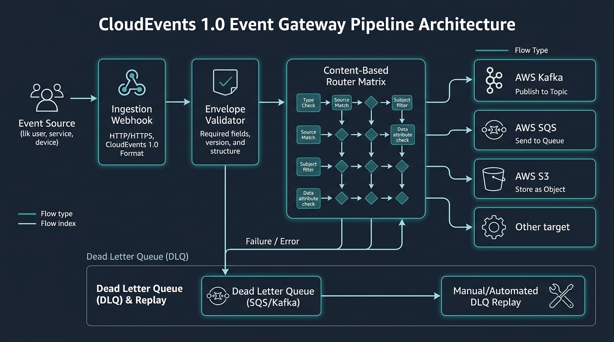
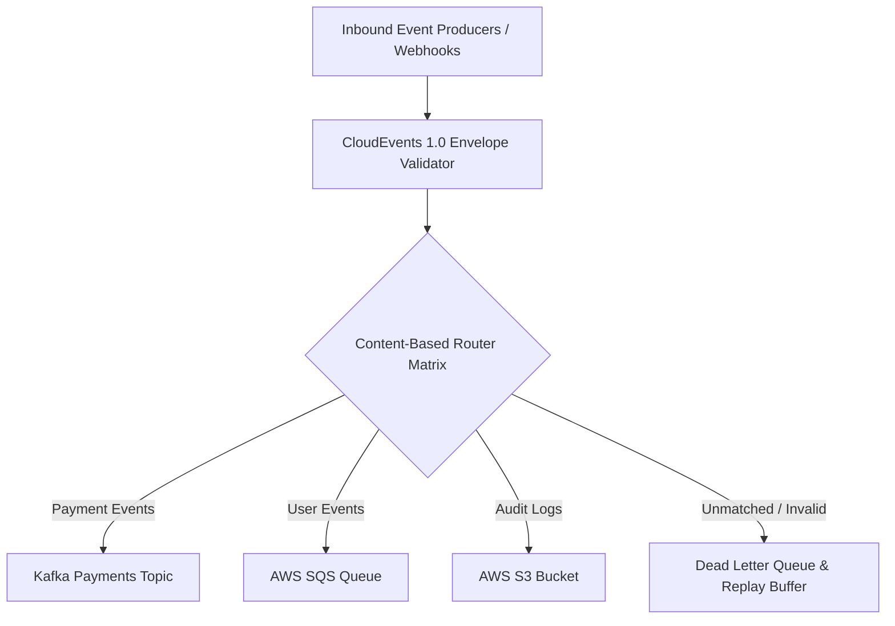

<div align="center">


# Enterprise Event Gateway

### CNCF CloudEvents 1.0 High-Throughput Event Ingestion, Content-Based Routing & DLQ Replay Engine

[](https://cloudevents.io)
[](https://devopstrio.co.uk)

</div>

---

## 🎯 Architecture Overview & Problem Statement

Event-driven architectures across multi-cloud infrastructure frequently suffer from fragmented event payloads, unvalidated schemas, and lost events during downstream sink outages.

The **Enterprise Event Gateway** standardizes all cross-domain event telemetry using the **CNCF CloudEvents 1.0 Specification**. It provides content-based routing rules, automated schema validation, Prometheus operational metrics, and deterministic Dead Letter Queue (DLQ) event replay mechanisms.



---

## 🔄 Execution Pipeline



---

## 💻 CLI Quickstart (`eegctl`)

Manage events, inspect schemas, and replay dead-lettered payloads directly using the built-in `eegctl` tool:

```bash
# Validate CloudEvent v1.0 Envelope
python -m cmd.eegctl.main validate

# Execute Content-Based Routing Evaluation
python -m cmd.eegctl.main route

# Replay Dead Letter Queue (DLQ) Items
python -m cmd.eegctl.main replay
```

---

## 📦 Deployment via Helm

```bash
# Deploy to Kubernetes Cluster via Helm
helm upgrade --install enterprise-event-gateway deploy/helm/enterprise-event-gateway \
  --namespace event-mesh \
  --create-namespace
```

---

## 🧪 Testing Suite

```bash
# Execute Pytest Unit & Integration Tests
pytest -v tests/
```

<div align="center">

<sub>&copy; 2026 Devopstrio &mdash; Engineering Uninterrupted Global Workforce Productivity.</sub>

</div>
